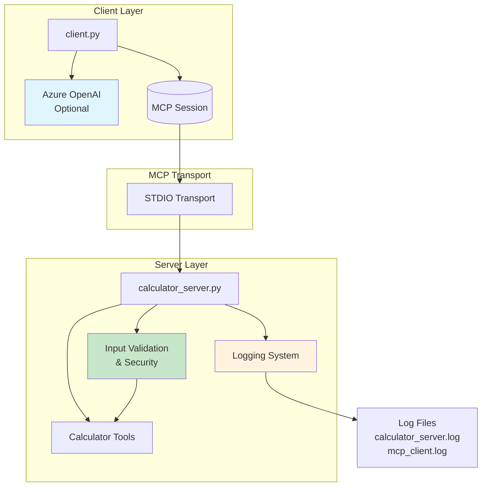
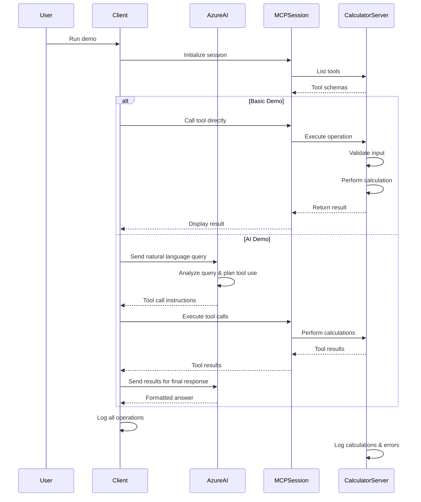

# MCP Calculator Demo

A robust demonstration of the Model Context Protocol (MCP) with a secure calculator server and client that integrates with Azure OpenAI, featuring comprehensive error handling, input validation, and logging.

## Features

- **🔒 Secure Calculator Server**: Provides mathematical operations as MCP tools with advanced security
  - Addition (`add`)
  - Multiplication (`multiply`)
  - Subtraction (`subtract`)
  - Division (`divide`)
  - Power/Exponentiation (`power`)

- **🤖 Intelligent Client**: Demonstrates MCP usage with two modes:
  - **Basic Mode**: Direct tool invocation with validation
  - **AI-Integrated Mode**: Natural language queries processed by Azure OpenAI with automatic tool calling

- **🛡️ Security & Validation**:
  - Input size limits to prevent overflow/underflow
  - NaN and infinity detection and rejection
  - Type validation with detailed error messages
  - Mathematical edge case handling (0^0, large exponents)

- **📊 Logging & Monitoring**:
  - Structured logging to both console and files
  - Operation tracking and error reporting
  - Performance monitoring

- **🧪 Testing**: Comprehensive unit test suite (25 tests covering all operations and edge cases)

## Prerequisites

- Python 3.8+
- Azure OpenAI account (optional, for AI-integrated demo)

## Installation

1. Clone or download this repository
2. Create and activate a virtual environment:
   ```bash
   python -m venv venv
   .\venv\Scripts\activate  # On Windows
   # source venv/bin/activate  # On macOS/Linux
   ```
3. Install dependencies:
   ```bash
   python -m pip install -r requirements.txt --trusted-host pypi.python.org --trusted-host files.pythonhosted.org --trusted-host pypi.org --upgrade pip
   ```

## Configuration

### Environment Variables

Create a `.env` file in the project root:

```env
# Azure OpenAI Configuration (optional, for AI demo)
AZURE_OPENAI_API_KEY=your_api_key_here
AZURE_OPENAI_ENDPOINT=https://your-resource.openai.azure.com/
AZURE_OPENAI_DEPLOYMENT=your-deployment-name
```

The AI-integrated demo will be skipped if Azure OpenAI credentials are not configured.

## Usage

### Running the Demo

Execute the client to see both basic and AI-integrated demos:

```bash
python client.py
```

### Expected Output

1. **Basic Demo**: Lists available tools and demonstrates direct tool invocation
2. **AI-Integrated Demo**: Processes natural language queries using Azure OpenAI (if configured)

### Manual Server Usage

You can also run the server independently:

```bash
python calculator_server.py
```

The server uses STDIO transport for MCP communication and logs to `calculator_server.log`.

## Usage Examples

### Basic Tool Invocation

```python
# Direct tool calls via MCP
result = await session.call_tool("add", {"a": 5, "b": 3})
# Returns: 8

result = await session.call_tool("power", {"base": 2, "exponent": 3})
# Returns: 8
```

### AI-Integrated Queries

```python
# Natural language processing with tool calling
user_query = "What is 15 divided by 3?"
# AI automatically calls divide tool with a=15, b=3
# Returns: "15 divided by 3 equals 5"
```

### Error Handling Examples

```python
# Division by zero
await session.call_tool("divide", {"a": 5, "b": 0})
# Raises: ValueError: Division by zero is not allowed. The divisor (b) cannot be zero.

# Invalid input type
await session.call_tool("add", {"a": "not_a_number", "b": 3})
# Raises: ValueError: Parameter 'a' must be a number (int or float), but received str: not_a_number

# Out of range values
await session.call_tool("power", {"base": 2, "exponent": 2000})
# Raises: ValueError: Exponent 2000 is too large. Maximum allowed is 1000.
```

## Available Tools

| Tool | Description | Parameters | Validation |
|------|-------------|------------|------------|
| `add` | Add two numbers | `a`: number, `b`: number | Type and range checking |
| `multiply` | Multiply two numbers | `a`: number, `b`: number | Type and range checking |
| `subtract` | Subtract second number from first | `a`: number, `b`: number | Type and range checking |
| `divide` | Divide first number by second | `a`: dividend, `b`: divisor (non-zero) | Zero division prevention |
| `power` | Raise base to exponent | `base`: number, `exponent`: number | Overflow and edge case handling |

## Security Features

- **Input Validation**: All inputs are validated for type, range, and mathematical validity
- **Size Limits**: Maximum and minimum value constraints prevent overflow/underflow
- **NaN/Infinity Protection**: Automatic detection and rejection of invalid floating-point values
- **Mathematical Safety**: Handles edge cases like 0^0, large exponents, and precision issues
- **Error Sanitization**: Detailed but safe error messages that don't leak sensitive information

## Testing

Run the comprehensive test suite:

```bash
python -m pytest test_calculator_server.py -v
```

The test suite covers:
- ✅ 25 unit tests for all calculator operations
- ✅ Input validation and type checking
- ✅ Error condition handling
- ✅ Edge cases and boundary conditions
- ✅ Security validation

## Architecture & Flow

### System Architecture



### Data Flow



### File Structure

```
mcp-demo/
├── calculator_server.py      # MCP server with secure calculator tools
├── client.py                  # MCP client with AI integration
├── test_calculator_server.py # Comprehensive unit tests
├── requirements.txt           # Python dependencies
├── README.md                  # This documentation
├── .env                       # Environment variables (optional)
├── calculator_server.log     # Server operation logs
├── mcp_client.log            # Client operation logs
└── .gitignore                # Git ignore patterns
```

## Error Handling

The system provides comprehensive error handling at multiple levels:

- **Input Validation**: Type checking, range validation, NaN/infinity detection
- **Mathematical Safety**: Division by zero, overflow prevention, edge case handling
- **Network Resilience**: Connection error handling, timeout management
- **Logging**: Structured error logging with context and timestamps
- **Graceful Degradation**: AI features work without Azure OpenAI credentials

## Development

### Adding New Tools

1. Define the tool function in `calculator_server.py`
2. Decorate with `@mcp.tool()`
3. Add comprehensive docstring with examples
4. Implement input validation using `validate_number()`
5. Add appropriate logging
6. Update tool list in `client.py` output
7. Add corresponding tests in `test_calculator_server.py`

### Security Considerations

- All inputs are validated before processing
- Mathematical operations check for overflow/underflow
- Error messages are informative but don't leak sensitive data
- Logging includes operation tracking but not sensitive values
- Network communications use secure protocols

### Performance Monitoring

- Operation timing and logging
- Error rate tracking
- Memory usage monitoring through logging
- Tool call frequency analysis

## Contributing

1. Follow the existing code style and security patterns
2. Add comprehensive tests for new features
3. Update documentation for any changes
4. Ensure all tests pass before submitting

## License

This project is for demonstration purposes. Feel free to modify and extend.